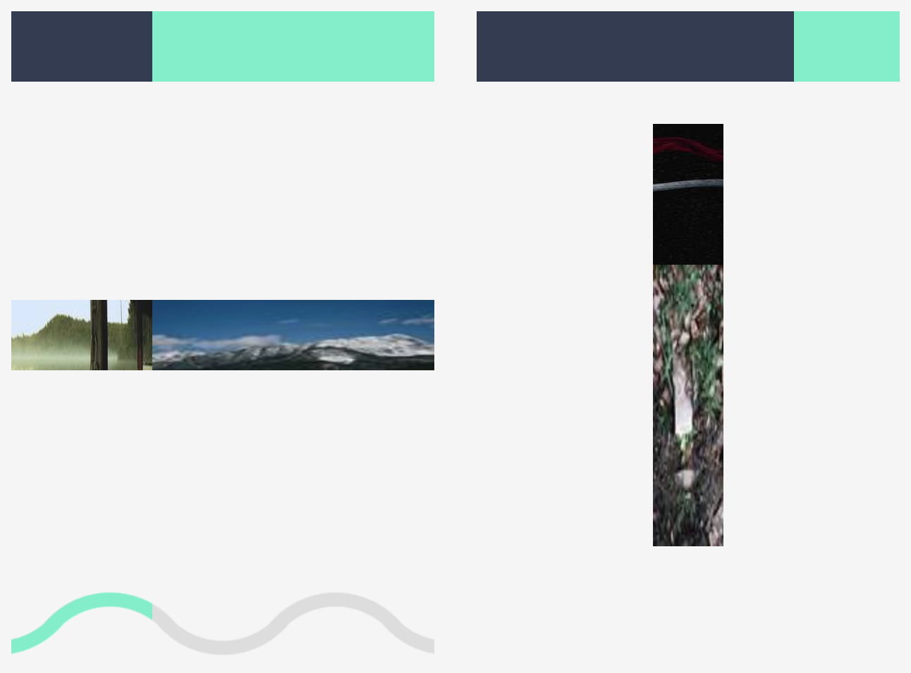

# ngx-progress

A library for limiting the number of lines in a flex container, complete with customizable expand and collapse.



```html
<ng-template
  class="horizontal-progress-bar"
  *ngxProgress="
    let percentages of ['reviewed', 'pending'];
    in: answers;
    key: 'status'
  "
>
  <div class="progress-item dark-blue" [style.width.%]="percentages[0]"></div>
  <div class="progress-item cyan" [style.width.%]="percentages[1]"></div>
</div>
<div
  class="horizontal-progress-bar"
  *ngxProgress="
    let percentages of ['reviewed', 'pending'];
    in: answers;
    key: 'status'
  "
>
  <div class="progress-item dark-blue" [style.width.%]="percentages[0]"></div>
  <div class="progress-item cyan" [style.width.%]="percentages[1]"></div>
</div>
```

```ts
answers = [
  {
    status: 'pending',
    comment: 'answer 1',
  },
  {
    status: 'pending',
    comment: 'answer 2',
  },
  {
    status: 'reviewed',
    comment: 'answer 3',
  },
];
```

## How to use

The library documentation is available over at
<https://lesfabricants.github.io/libraries/#/progress>

&nbsp;

_This library was generated with [Angular CLI](https://github.com/angular/angular-cli) version 16.1.0._
